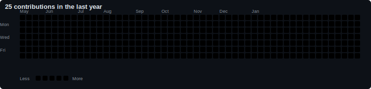

## 🇺🇸🇵🇷 Hi there 👋 <picture></picture>

## 🛠️ Technical Skills

### 💻 Languages

### 🌐 Frontend

### ⚙️ Backend

### 🗄️ Databases

### 🚀 DevOps & Cloud

### 📱 Mobile

### 🤖 AI / ML

---

## My Contribution Graph

